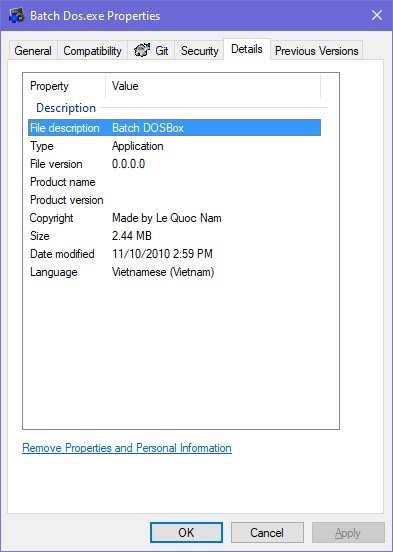
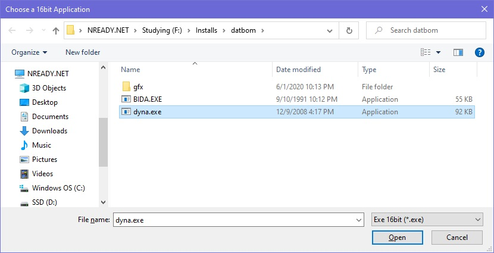
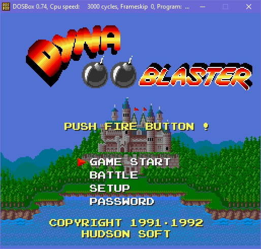

# Batch DOS

 

An DOSBox Wrapper by AutoIt to run any 16bit Application just in a single click.

Simple by run the program, choose a 16bit application and the application will run as a hero.

# Setup and Run

- Download and Install AutoIt: https://www.autoitscript.com/site/autoit/downloads/
- Clone the repository: `git clone https://github.com/leqnam/batch-dos.git`
- Open and build the au3 file.

or just run the pre-built `build/Batch DOS.exe`. The pre-built was built on Nov 10 2010.

# Demo

Simple by run the program, choose a 16bit application and the application will run as a hero.

Dyna is running under my Windows 10 x64

# Acknowledgements

- DOSBox homepage: https://www.dosbox.com/
- Blog (In Vietnamese): https://nready.net/batch-dos-cong-cu-ho-tro-chay-cac-ung-dung-16bit/
- Github: https://github.com/leqnam/batch-dos
- Pre-built: http://www.mediafire.com/download.php?wqkovcl3wm33h9t

# License

Author: Nam Le

leqnam@live.com, nam@nready.net

https://nready.net

First Release: 11/10/2010, 
Open source: 01/23/2021

MIT